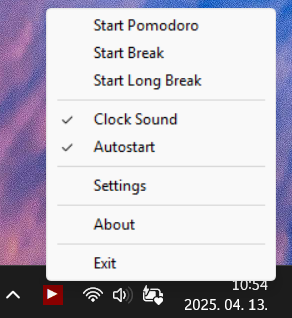

# Pomodoro Timer
A simple, lightweight Pomodoro timer application that runs in the system tray. Built with MingW, it helps you manage your work and break sessions efficiently using the Pomodoro Technique.




[By me a coffee](https://buymeacoffee.com/lutischanf)

## Features
- System tray integration with a dynamic icon showing the timer status
- Audio feedback with beeps for countdown and completion
- Configurable durations for Pomodoro, short break, and long break sessions
- Tracks completed Pomodoro sessions with visual indicators
- Windows support

# Downloads
- [Github releases](https://github.com/lutischan-ferenc/pomodoro-timer-v2/releases)
- [Majorgeeks](https://www.majorgeeks.com/files/details/pomodoro_timer.html)

# User Guide

## Basic Usage

### Left Click on System Tray Icon:

- If no timer is running: Starts a new timer. It begins with a Pomodoro session if no previous session was active, or continues with the next logical session (Pomodoro → Break, Break → Pomodoro).
- If a timer is running: Stops the current timer and resets the icon to the play symbol (▶), indicating the timer is stopped.
- The sequence alternates between Pomodoro and Break sessions automatically.

### Right-Click Menu

- Right Click on System Tray Icon: Opens a context menu with the following options:
- Pomodoro Timer v1.1: Opens the GitHub repository in your default browser.
- Start Pomodoro: Directly starts a new Pomodoro session (stops any running timer).
- Start Break: Directly starts a short break (stops any running timer).
- Start Long Break: Directly starts a long break (stops any running timer).
- Start on System Startup (only on Windows)
- Clock sound (play Clock effect on Pomodoro)
- Settings: Configure timer durations.
- Exit: Closes the application.

### Timer Progression:

- After a Pomodoro session completes, the next left click will start a Break.
- After a Break completes, the next left click will start a Pomodoro.
- This ensures a natural workflow following the Pomodoro Technique.

### The system tray icon displays:

- A countdown number (in minutes or seconds when below 1 minute) while a timer is running.

  
- A play symbol (▶) when the timer is stopped.

  
- Green Dots: Small green dots at the bottom of the icon indicate the number of completed Pomodoro sessions (1–4 dots).
- After 4 Pomodoro sessions, the counter resets to 1, and a long break is recommended (configurable in settings).
- Tooltip: Hovering over the icon shows the exact remaining time in MM:SS format (e.g., "05:23") or a status message when stopped (e.g., "Break stopped - Click to start pomodoro").

  

### Audio Feedback:
- A beep sounds during the last 10 seconds of a timer.
- A final beep plays when a session completes.

### Settings
Access: Select "Settings" from the right-click menu.
  

### Configuration:
- A temporary .json file opens in your default text editor with the following fields:
- pomodoro_duration: Duration of a Pomodoro session in minutes (default: 25).
- short_break_duration: Duration of a short break in minutes (default: 5).
- long_break_duration: Duration of a long break in minutes (default: 15).
- enable_clock_sound: Enable clock sound (default: 1).
- Edit the values, click ok. The changes are automatically applied.

### Pomodoro Tracking
- The application tracks completed Pomodoro sessions with green dots (up to 4).
- After 4 Pomodoros, the dot counter resets to 1, indicating a cycle completion. While the app doesn’t automatically start a long break, this reset signals you to take a longer rest (use the "Start Break" menu option and adjust the duration in settings if needed). System Tray Icon Details
- Stopped State: Shows "▶" with the current number of green dots.

### Running State: Shows the remaining time:
- Above 1 minute: Displays whole minutes (e.g., "25").
- Below 1 minute: Displays seconds (e.g., "59").
- The tooltip provides additional context, such as the exact remaining time or the next suggested action.

## Building and Running

### In Windows cmd
```
\mingw32\bin\windres pomodoro-timer.rc -o pomodoro-timer_res.o
\mingw32\bin\gcc -ffunction-sections -fdata-sections -s -o pomodoro-timer pomodoro-timer.c pomodoro-timer_res.o -mwindows -lwinmm -Wl,--gc-sections -static-libgcc
```

## Configuration
The application stores its settings in a JSON file located at:
- Windows: `pomodoro_settings.json`

You can modify the timer settings directly in this file or open it through the application menu.

## License
This project is licensed under the MIT License.
